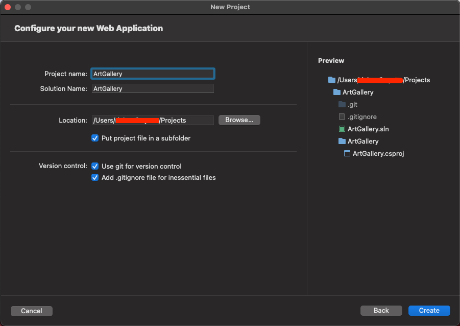
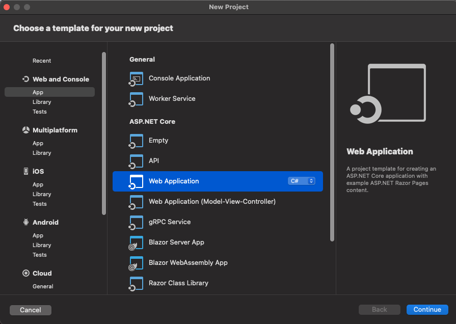
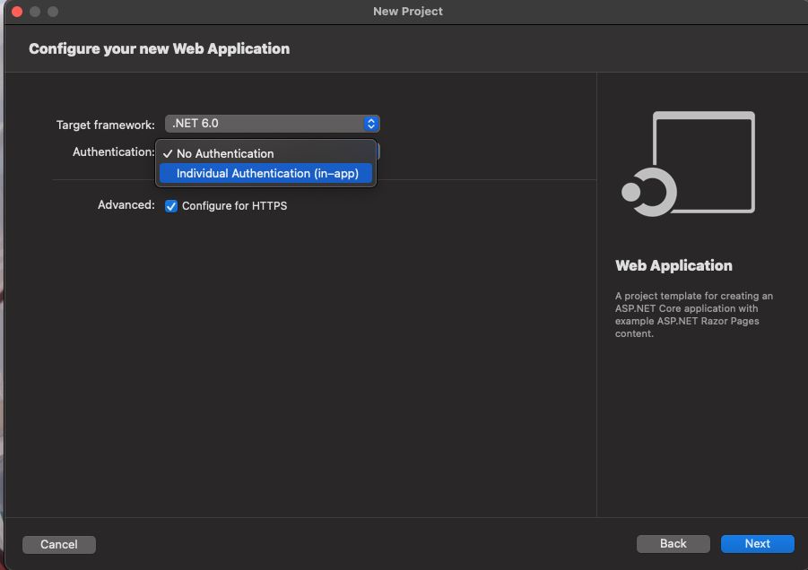
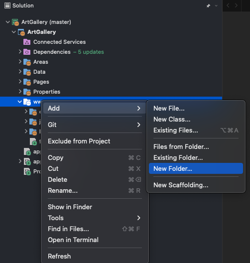
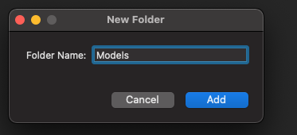
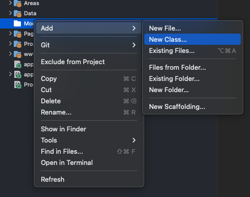
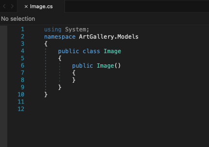
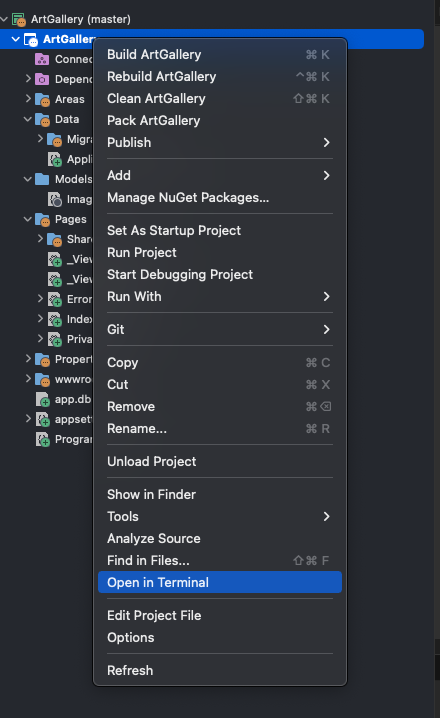
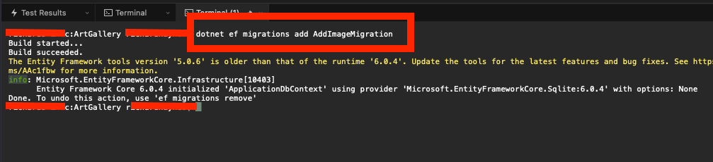
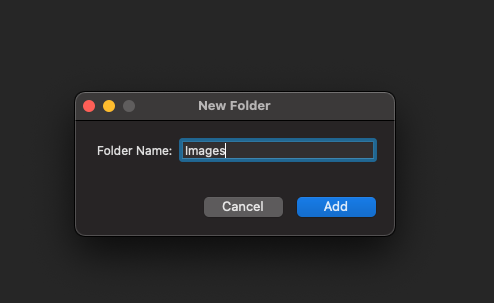

# Beginner-ArtGallery-Project
Pre-Requesites
To follow along with this project you will need the following:
An IDE or Editor that supports C# 9 > and .NET 6 >. I used Visual Studio For Mac 2022
SQLite3. While not necessary an SQL editor that can work with SQLite is very helpful. I used Table Plus which has a free version.
Goal:
The goal of this is to walk through a simple project to help learn beginner developers how to use C# to build a very simple web application. This project attempts to combine many of the basica language concepts as well as some more medium level topics to help paint a full picturing of how to build an usable system with these tools and techniques. The project we are building will be a photo gallery which will demostrate how to use C# to upload a file and read data from a relational database, in this case SQLite. 
If you are new to C# and Visual Studio here are some other Links that may be worth while to check either before or after you complete this guide depending on your level
here's a [link](https://docs.microsoft.com/en-us/visualstudio/mac/tutorial-aspnet-core-vsmac-getting-started?view=vsmac-2019)
###Part 1:
We are first going to start by using Visual Studio to create a new project, be sure to pick the Web Application template to remain as close as possible with this project guide. 
 
 

Ensure that you select the "Individual Authentication (in-app) of the Authentication section.. Next once the project has been successfully created lets use Visual Studio to create a few new folders. The first new folder will be named Models. Model is a term used in software engineering to represent a class who's purpose is to act as a well "Model" of some real world data. You will find many more well defined articles around what should and shouldn't be a model but since this is a beginner level that will be our simple definition for now.
.
.
Now that our Models folder has been created we are going to create our first class.
.
.
Go a head and modify the class that has been created to look like the code below 

 ```C#
using System;
using System.ComponentModel.DataAnnotations;
using System.ComponentModel.DataAnnotations.Schema;

namespace ArtGallery.Models
{
	public class Image
	{
		[Key]
		public int Id { get; set; }
		public string? FilePath { get; set; }
		[Required]
		public Guid Guid { get; set; } = Guid.NewGuid();
		[NotMapped,Required(ErrorMessage = "Image Must be Provided"), Display(Name ="File To Upload")]
    public IFormFile? FormFile { get; set; }
		public DateOnly CreatedDate { get; set; } = DateOnly.FromDateTime(DateTime.Today);
	}
}


  ```
Since we are working with images and databases we need to keep track of a few data points. First it is always a good id to have a unique number based id on a database record that a user may not even work with. Next we need a unique none number based id. This is referred to as a guide or generated unique id. The database will be designed to handle the value for the Id field but our code will auto build the guid. The FilePath property will keep track of where the file will be copied to and the FormFile will keep track of the actual information about the File itself. Pay close attention to the Keyword above the IFormFile property called [NotMapped] as that will have an important meaning in the next part.

###Part 2: Update Our Database
For this project most of our database work will be handled by code provided by the C# library called Entity Framework Core or Ef Core for short. Ef Core is a library type reffered to as a ORM short for Object Relational Mapper. In simple terms it takes data and makes classes from that data and vice versa. The code that will control these instructions is currently housed in a class in our Data folder called ApplicationDbContext. The template we picked created this for us but note if you as a developer have a need you could defiently create a DbContext yourself. 
```C#
using ArtGallery.Models;
using Microsoft.AspNetCore.Identity.EntityFrameworkCore;
using Microsoft.EntityFrameworkCore;

namespace ArtGallery.Data;

public class ApplicationDbContext : IdentityDbContext
{
    public ApplicationDbContext(DbContextOptions<ApplicationDbContext> options)
        : base(options)
    {
    }
    public DbSet<Image> Images { get; set; }
    protected override void OnModelCreating(ModelBuilder builder)
    {
        base.OnModelCreating(builder);
        builder.Entity<Image>(entity => {
            entity.Property(e => e.Id);
            entity.Property(e => e.Guid);
            entity.Property(e => e.FilePath);
            entity.Property(e => e.CreatedDate);
        });
    }
}

```
This file is doing a lot so I'm going to provide a summary. In short this code is build a collection of the Image class we created and names it Images. It will then make a table called Images and file it with data for each image. The OnModelCreating function has the job of controlling which properties of each instance of an Image get turned into a column in our database. As you can see the FormFile property isn't listed because that data only makes sense for the code file but doesn't make sense to store in the database itself. Thats why we marked it as [NotMapped]. 

Now to trigger our DbContext to work we need to open a terminal. This can be done directly from Visual studio as seen below. 
.
In the terminal type the following commands

```
dotnet ef migrations add AddImageMigration
```
If this is successful your output should look like the below screenshot.
.
What we've done is we have created database migrations. Migrations is just a term used by libraries in places of the phrase "database changes". Our file command for this section will be the one seen below.
```
dotnet ef database update
```
This command does the actual work of updating our database with the migrations.

###Part 3: Update Our Index Page
Now that our database has been created lets next add our Images folder and modfy our Index Files. You can find both the Index.cshtml and the Index.cshtml.cs file in the Pages folder. The Index.cshtml.cs file will be hidden just below the Index.cshtml file and can be revealed by pressing the > next to the Index.cshtml file. 
To create our images folder we really only need to copy some of the steps from Part I but the images folder now just needs to be a sub folder of wwroot folder so our Pages can access that folder.
.
.
Now that those have been created successfully we can modify our Index files to look like the code below. 
Index.cshtml.cs
 ```C#
using Microsoft.AspNetCore.Mvc;
using Microsoft.AspNetCore.Mvc.RazorPages;
using ArtGallery.Data;
using ArtGallery.Models;
using Microsoft.EntityFrameworkCore;

namespace ArtGallery.Pages;

public class IndexModel : PageModel
{
    private readonly ILogger<IndexModel> _logger;
    private readonly ApplicationDbContext _dbContext;
    private readonly IWebHostEnvironment _webHostEnvironment;
    [BindProperty]
    public Image ImageToUpload { get; set; }
    public List<Image> Gallery { get; set; }

    public IndexModel(ILogger<IndexModel> logger, ApplicationDbContext dbContext, IWebHostEnvironment webHostEnvironment)
    {
        _logger = logger;
        _dbContext = dbContext;
        _webHostEnvironment = webHostEnvironment;
    }

    public async Task<IActionResult> OnGet()
    {
        Gallery = await _dbContext.Images.ToListAsync();
        return Page();
    }

    public async Task<IActionResult> OnPost()
    {
        if(!ModelState.IsValid)
        {
            ModelState.AddModelError(string.Empty,"Model In Invalid State");
            return Page();
        }
        if(ImageToUpload.FormFile is null)
        {
            ModelState.AddModelError(string.Empty, "File Name not Found");
            return Page();
        }
        try
        {
            string imageFolder = Path.Combine(_webHostEnvironment.WebRootPath, "Images");
            string filename = $"{ImageToUpload.Guid}_{ImageToUpload.FormFile.FileName}";
            string filePath = Path.Combine(imageFolder, filename);
            ImageToUpload.FilePath = filename;
            if(!System.IO.File.Exists(filePath))
            {
                using (var stream = new FileStream(filePath, FileMode.OpenOrCreate))
                {
                    await ImageToUpload.FormFile.CopyToAsync(stream);
                }
                await _dbContext.Images.AddAsync(ImageToUpload);
                await _dbContext.SaveChangesAsync();
                Gallery = await _dbContext.Images.ToListAsync();
                return Page();
            }
            ModelState.AddModelError(string.Empty, "File Path Exists");
            return Page();

        }
        catch (Exception ex)
        {
            _logger.LogError($"{ex}");
            return RedirectToPage("Error");
        }
    }
}

  ```
  Index.cshtml
  ```C#
  @page
@model IndexModel
@{
    ViewData["Title"] = "Home page";
}

<form method="post" enctype="multipart/form-data">
    <div asp-validation-summary="ModelOnly" class="text-danger"></div>
    <div class="text-center">
        <h1 class="display-4">Welcome To Your Custom Art Gallery</h1>
    </div>
    <div class="col-md-6">

        <div class="form-group">
            <label asp-for="ImageToUpload.FormFile" class="control-label"></label>
        </div>
        <div class="form-group">
            <input asp-for="ImageToUpload.FormFile" id="customFile" type="file" required>
            <button class="btn btn-success">Add New Image File</button>
            <span asp-validation-for="ImageToUpload.FormFile" class="text-danger"></span>
        </div>
    </div>
</form>
<div>
    <table class="table table-bordered">
        <thead>
            <tr>
                <th>#</th>
                <th>File Name</th>
                <th>Image</th>
                <th>Date Added</th>
            </tr>
        </thead>
        <tbody>
            @if(Model.Gallery is not null && Model.Gallery.Any())
                {
                    foreach (var item in Model.Gallery)
                    {
                        <tr>
                            <td>@item.Id</td>
                            <td>@item.FilePath</td>
                            <td></td>
                            <td>@item.CreatedDate</td>
                        </tr>
                    }
                }
        </tbody>
    </table>
</div>
  ```
Once that file has been changed you should be able to run the project and upload files to a gallery of images.
